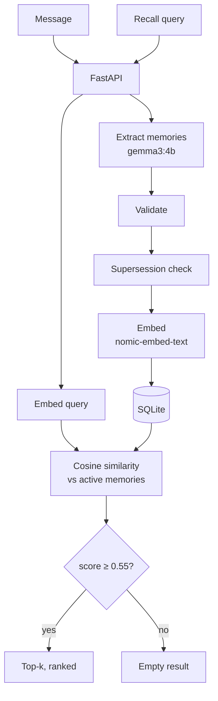

# Memory Orbs 🔮

A local-first semantic memory engine. Feed it messages, it extracts what matters, stores it in SQLite, and recalls it by meaning. When facts change, old memories get superseded. When it doesn't know, it says nothing.

Everything runs locally through Ollama. No hosted APIs.

## Features

- **Persistent:** SQLite, survives restarts
- **LLM extraction:** pulls facts, preferences, projects, events, goals out of raw messages
- **Semantic recall:** embeddings + cosine similarity, so wording doesn't have to match
- **Supersession:** newer info replaces outdated memories (history kept, not deleted)
- **Unknown-query rejection:** similarity threshold returns empty instead of junk
- **REST API:** FastAPI
- **Eval + benchmark:** recall hit rate, unknown rejection, latency

## Architecture



| Component | Tech |
|---|---|
| API | FastAPI + Uvicorn |
| Storage | SQLite |
| Extraction / update reasoning | `gemma3:4b` (Ollama) |
| Embeddings | `nomic-embed-text` (Ollama) |
| Similarity | NumPy |

## Quickstart

**Needs:** Python 3.10+, Git, [Ollama](https://ollama.com) running.

```bash
git clone https://github.com/Awesome-00/memory-orbs.git
cd memory-orbs

python3 -m venv .venv
source .venv/bin/activate          # Windows: .venv\Scripts\Activate.ps1
pip install numpy ollama fastapi uvicorn

ollama pull gemma3:4b
ollama pull nomic-embed-text

python -c "from store import init_db; init_db()"
uvicorn api:app --reload
```

API at `http://127.0.0.1:8000`, interactive docs at `/docs`.

## API

| Method | Endpoint | What it does |
|---|---|---|
| `POST` | `/memory` | Ingest a message, extract + store memories |
| `POST` | `/recall` | Get memories relevant to a query |
| `GET` | `/memories` | List stored memories |
| `DELETE` | `/memory/{memory_id}` | Delete a memory |

```bash
# ingest
curl -X POST http://127.0.0.1:8000/memory \
  -H "Content-Type: application/json" \
  -d '{"message": "I prefer C++ for competitive programming."}'

# recall
curl -X POST http://127.0.0.1:8000/recall \
  -H "Content-Type: application/json" \
  -d '{"query": "Which language do I use for competitive programming?"}'
```

> Request field names above are illustrative. Check `api.py` / `/docs` for the real schemas.

## Memory model

| Field | Purpose |
|---|---|
| `id` | Unique ID |
| `text` | Self-contained memory statement |
| `type` | `fact`, `preference`, `project`, `event`, or `goal` |
| `source_message` | Original message it came from |
| `embedding` | Vector, stored as a binary blob |
| `status` | `active` or `superseded` |
| `superseded_by` | ID of the replacement memory |
| `created_at` | Timestamp |

## Design Q&A

### Why this storage and retrieval setup?

SQLite is zero-setup, lives in one file, and handles status, timestamps, and supersession links without a database server. Embeddings beat keyword search because users rarely ask in the same words they stored. Ollama keeps extraction and embedding fully local.

Tradeoff: retrieval is a brute-force NumPy scan over active memories. Simple and easy to debug, but linear in memory count.

### How does it decide what becomes a memory?

`gemma3:4b` reads each message and returns a JSON array of `{text, type}`. The prompt tells it to keep statements self-contained, not invent anything, skip small talk, and return `[]` if nothing is worth keeping. The output is then validated in code (valid JSON, valid types) before anything is stored.

There is no importance scoring or duplicate merging yet. Quality depends on the extraction model.

### How does it handle updated or contradictory information?

Before saving a new memory, it looks only at active memories **of the same type**, shortlists close ones by embedding similarity, and asks the LLM whether any are genuinely replaced.

- "Laptop has 16 GB RAM" → "Laptop has 32 GB RAM": superseded
- "I use Python" → "I use C++ for CP": both stay

Superseded memories are kept with `status=superseded` and a `superseded_by` pointer. Recall only searches active ones. Correctness still depends on the LLM's judgment.

### What happens when the answer isn't in memory?

Anything scoring below **0.55** cosine similarity is dropped. If nothing survives, recall returns an empty list instead of the "closest" bad match. Callers should read empty as "nothing relevant found", not invent an answer.

Reality check: this works poorly right now. Unknown rejection scored **1/5** in eval. A single global threshold lets plausible-but-unrelated memories through. See [Evaluation](#evaluation).

### What breaks first at 10 million memories?

**The linear scan.** Every query loads active rows and computes similarity against every vector: roughly O(N·d) per query, plus heavy row fetching and RAM pressure.

Fix:

1. Move vectors into an ANN index (FAISS, Qdrant, etc.)
2. Keep SQLite (or Postgres) for metadata and lifecycle (type, status, supersession)
3. Filter by metadata before ranking
4. Queue ingestion so extraction doesn't block recall
5. Add BM25 hybrid search for names and exact identifiers
6. Benchmark at real scale before trusting any of this

An index fixes the scan, not everything: index memory, updates, filtering, and concurrency all become new problems.

## Evaluation

`eval_cases.json` + `evaluate.py`. The evaluator builds a temp DB, ingests recall-case messages, then runs recall and unknown queries. Unknown-case messages are never ingested, so the system can't learn the answer it's supposed to not know.

```bash
python evaluate.py
MEMORY_EVAL_TOP_K=5 python evaluate.py
```

### Threshold sweep

Retrieval threshold vs. results (same 30 cases, top-k = 5):

| Threshold | Recall hit rate | Unknown rejection | Overall accuracy |
|---:|---:|---:|---:|
| 0.55 | 23/25 (92.0%) | 1/5 (20.0%) | 24/30 (80.0%) |
| **0.65** | **23/25 (92.0%)** | **3/5 (60.0%)** | **26/30 (86.7%)** |
| 0.75 | 13/25 (52.0%) | 5/5 (100%) | 18/30 (60.0%) |

Lowering the threshold from 0.65 to 0.55 gains no recall but lets in unrelated
memories. Raising it to 0.75 rejects every unknown query but drops recall to 52%,
because many correct hits score between 0.65 and 0.75. 0.65 is the default.
Extraction by a local 4B model is non-deterministic, so differences of 1-2 cases
between runs are noise.

Recall hits are recall@5: the expected memory appears somewhere in the top 5.
Ranking quality is not measured separately.

Higher thresholds reject unknown queries more reliably but also cut off correct
memories: many correct hits score between 0.65 and 0.75. Extraction by a local
4B model is non-deterministic, so differences of 1-2 cases between runs are noise.

Recall is solid. Rejection is the weak spot. Only 30 cases and 5 unknowns, so treat these as early local numbers, not general claims. Recall hits are phrase-matched, which isn't full semantic verification.

## Latency benchmark

```bash
python benchmark.py
MEMORY_BENCHMARK_RUNS=30 python benchmark.py
```

3 warm-up queries, then 30 timed runs over 5 fixed queries. Timing covers query
embedding, similarity over all active memories, and ranking.

| Metric | Result |
|---|---:|
| Active memories | 46 |
| Timed queries | 30 |
| Median (p50) | 14.87 ms |
| p95 | 151.15 ms |
| Mean | 42.98 ms |
| Min / Max | 13.08 / 206.71 ms |

Warm numbers on one laptop (Intel Core Ultra, 32 GB RAM), not cold-start and not
at scale. The median is stable, but the tail is wide: with 30 samples, p95 rests
on about two slow runs. The spread most likely comes from embedding inference in
Ollama (model state, scheduling), not from the similarity search, which is
negligible at this size. This was not profiled separately.

## Project structure

```text
memory-orbs/
├── api.py            # FastAPI app + endpoints
├── ingest.py         # Extraction + supersession
├── retrieve.py       # Query embedding + semantic retrieval
├── store.py          # SQLite schema + storage ops
├── evaluate.py       # Retrieval eval
├── benchmark.py      # Latency benchmark
├── eval_cases.json   # Eval cases
├── tests/
└── README.md
```

`memory.db` is runtime data. Keep it out of git.

## Known limitations

- Small LLM extraction can be wrong, incomplete, or too broad
- Supersession can miss real updates or kill still-valid memories
- Similarity ≠ relevance; a single threshold is a blunt tool
- No duplicate merging or importance scoring
- Performance depends on your hardware and local models

## AI usage

Models in the pipeline:
- `gemma3:4b` (Ollama): memory extraction, typing, supersession decisions
- `nomic-embed-text` (Ollama): embeddings for memories and queries

AI assistance during development:
- **Claude:** scoping the project; writing `memory_schema` in `ingest.py`; wrote README
- **ChatGPT:** learning basic `sqlite3`; rephrasing `system_prompt` in `ingest.py`
- **AI (Claude/ChatGPT):** `cosine_similarity()` and NumPy help; general debugging
- **`evaluate.py`:** fully AI-written
- **`api.py`:** largely AI-written

Everything was run locally and checked against the eval suite and benchmark. I reviewed the full codebase and can explain every component.


